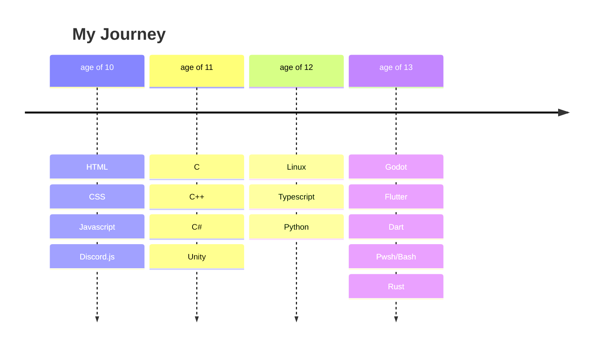

# Hi there, I'm Viktor Popp 👋

Welcome to my GitHub profile! I'm a passionate developer and technology
enthusiast. Here you'll find a collection of my projects, code contributions,
and more.

**My Rust OSDev Discord server:
[https://discord.gg/v9cjaBsnzJ](https://discord.gg/v9cjaBsnzJ)**

## About Me

- 🔭 I’m currently working on InfinityOS a small operating system
- 🌱 I’m currently learning about low-level assembly, C and Rust
- 🤔 I’m looking for help with operating system development
- 💬 Ask me about C/C++, operating systems or Game Development
- 📫 How to reach me: viktorpopp.dev@gmail.com
- 😄 Pronouns: He/Him
- ⚡ Fun fact: I started programming when i was 10

## Skills (From best to worst)

### Programming Languages

### Frameworks & Libraries

### Game Development

### Tools & Platforms (In random order)

## Projects

Here are some of my notable projects:

- [Hexium OS](https://github.com/HexiumOS/Hexium): 🦀 Lightweight
  operating system written in Rust.
- [The Slime Invasion](https://hexuro.itch.io/the-slime-invasion): A small
  vampire survivors-like game made during a summer camp called NerdCamp.
- [Learn Assembly](https://github.com/ViktorPopp/LearnAssembly): Full course on
  learning x64 assembly. Intended for system programmers, OS developers and
  reverse engineers.

<!--## My socials-->

## Git Stats

**Thanks for visiting my profile!**
